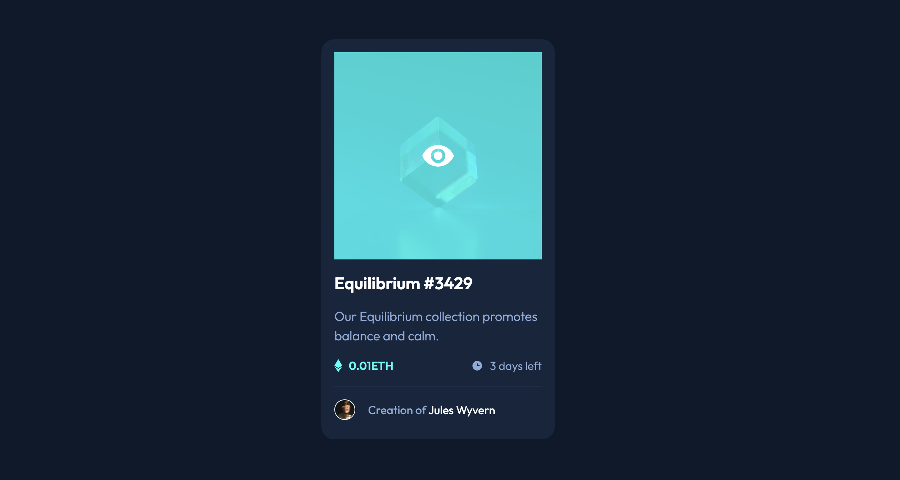

# Frontend Mentor - NFT preview card component solution

This is a solution to the [NFT preview card component challenge on Frontend Mentor](https://www.frontendmentor.io/challenges/nft-preview-card-component-SbdUL_w0U). Frontend Mentor challenges help you improve your coding skills by building realistic projects.

## Overview

### The challenge

Users should be able to:

- View the optimal layout depending on their device's screen size
- See hover states for interactive elements

### Screenshot

### Links

- Solution URL: [Github](https://github.com/hollyBelly2021/nft-preview-card-component-main)
- Live Site URL: [Live](https://hollybelly2021.github.io/nft-preview-card-component-main/)

## My process

### Built with

- Semantic HTML5 markup
- CSS custom properties
- Flexbox
- CSS Grid
- Mobile-first workflow

### What I learned

- First time using custom colors and initializing css properties at the beginning.
- First time using inheritance.

### Useful resources

- [From Design to Code // HTML & CSS from scratch // Frontend Mentor](https://youtu.be/KqFAs5d3Yl8?si=AtGxByl1a6agAZuf) - This is not the same Frontend Mentor exercise but I used a little bit of his practice as a reference.

## Author

- Frontend Mentor - [@hollyBelly2021](https://www.frontendmentor.io/profile/hollyBelly2021)
